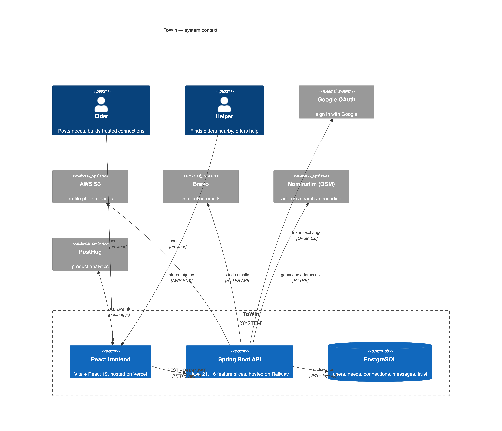
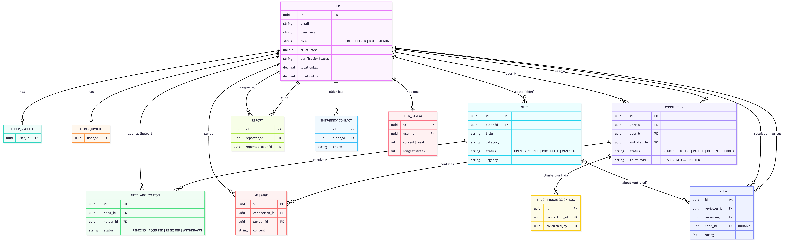
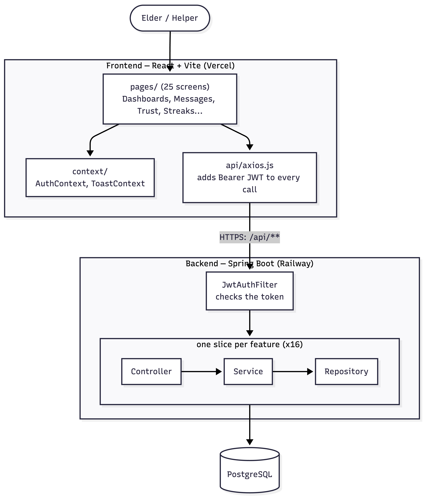
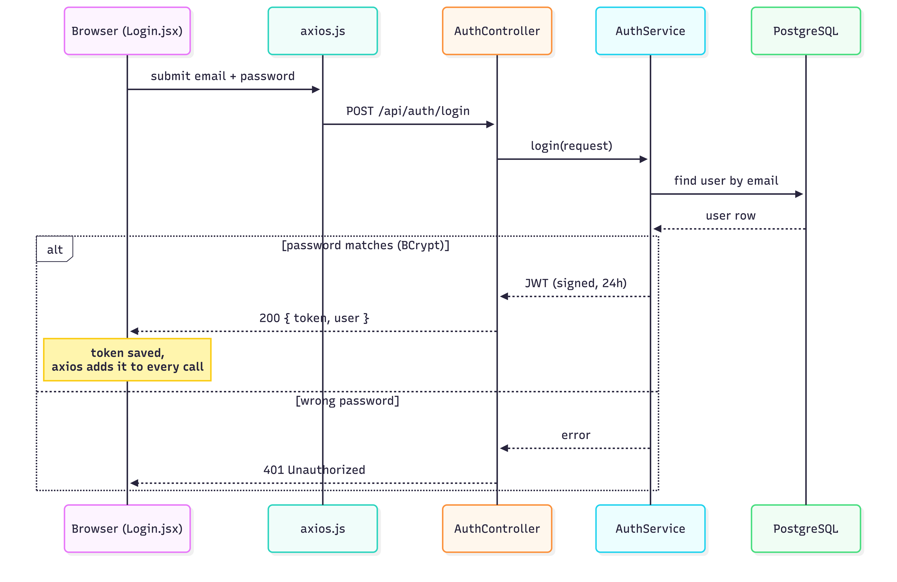
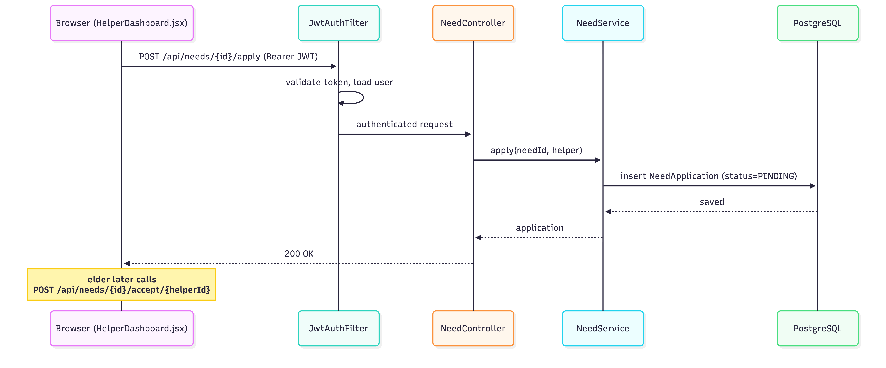
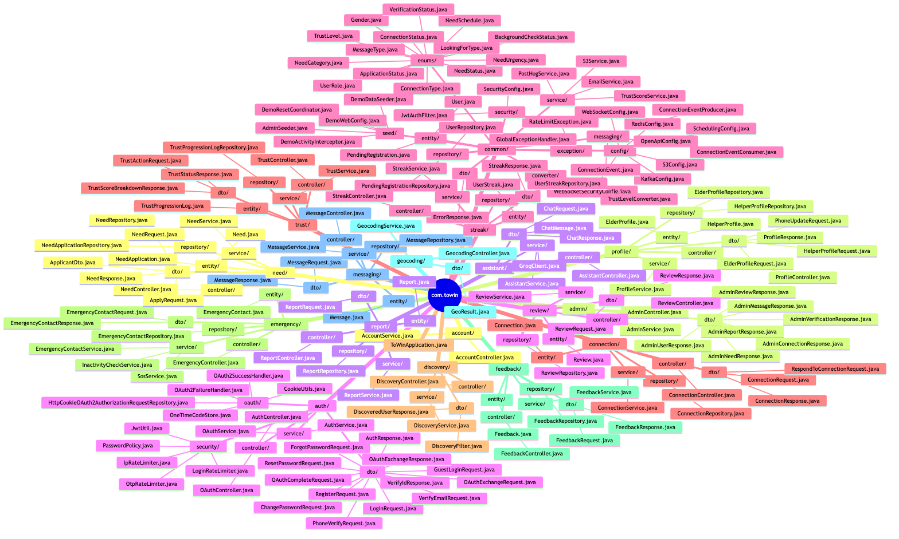
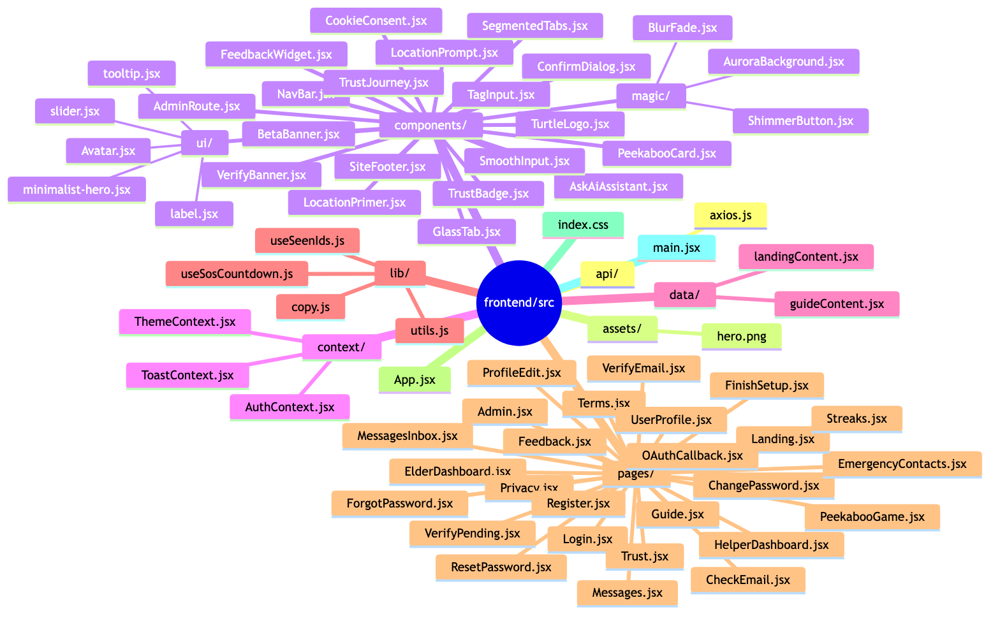

<div align="center">

# 🐢 ToWin

### It takes two To Win.

Youngers who help, elders who get help — and both win.

**[🚀 Try the live demo →](https://towin.vercel.app)**

*No signup needed — open the sign-in page and click **Try as an Elder** or **Try as a Helper**.*

</div>

---

## 🤝 What is ToWin?

ToWin brings together **two kinds of people** — and you pick which one you are when you create your account:

- **Elder** — an older person looking for friendship, company, or help with daily tasks.
- **Helper** — a younger person who gives time, company, and a hand with everyday things.

### Help is hard to find alone

Small daily things — like shopping, a ride, or someone to talk to — take energy that elders don't always have. On ToWin, an elder simply asks. Helpers nearby see the request and come to help with whatever is needed.

### Trust is earned, not given

Letting someone new into your life is a big step. So every member has a **Trust Score**, built from three things:

- **Profile** — a full profile with ID, phone, and photo, all checked.
- **Rooting (Trust Ladder)** — points earned each time a friendship takes a step forward.
- **Review** — star ratings from the people they have already helped.

*Elders see a helper's Trust Score before they ever say yes.*

### How trust grows — the Trust Ladder

Like a tree growing roots, every friendship on ToWin grows slowly, through **7 simple stages**:

> **Just Connected → Messaging → Phone Ready → Video Ready → Verified → Ready to Meet → Fully Trusted**

**Both people must agree to every step.** Nothing personal, like a phone number, is shared until trust has grown.

### Both sides win

> Elders have **time and money**, but need energy and company.
> Helpers have **energy and time**, but need money and care.
> **ToWin is where they meet and share — and both win.**

---

## 📸 A look inside

<table>
  <tr>
    <td align="center" width="50%"><b>Elder Dashboard</b></td>
    <td align="center" width="50%"><b>Helper Dashboard</b></td>
  </tr>
  <tr>
    <td></td>
    <td></td>
  </tr>
  <tr>
    <td align="center"><b>Trust Score</b></td>
    <td align="center"><b>Messaging</b></td>
  </tr>
  <tr>
    <td></td>
    <td></td>
  </tr>
  <tr>
    <td align="center"><b>Profile & AWS S3 Photo Upload</b></td>
    <td align="center"><b>Admin Panel</b></td>
  </tr>
  <tr>
    <td></td>
    <td></td>
  </tr>
  <tr>
    <td align="center"><b>Daily Streak</b></td>
    <td align="center"><b>How It Works</b></td>
  </tr>
  <tr>
    <td></td>
    <td></td>
  </tr>
</table>

---

## ✨ What you can do

- 🤝 **Build trust gradually** — connections move through levels (message → phone → meet), and **both people** confirm each step.
- 📝 **Post & answer needs** — elders post tasks, helpers apply, accepting one starts a connection.
- 💬 **Message privately** — chat opens once you connect; phone numbers stay hidden until trust is earned.
- ⭐ **Earn a trust score** — verification, trust-ladder progress, and reviews build your score, one connection at a time.
- 🔥 **Keep a streak** — daily elder check-ins.
- 🚨 **Stay safe** — emergency contacts, SOS, reviews, and reports.
- 👀 **Try it instantly** — one-click guest mode for beta testers.

---

## 🛠 Tech stack

| Area | Stack |
|---|---|
| **Frontend** | React 19 · Vite · React Router 7 · Tailwind CSS 4 · TanStack Query · Axios · Radix UI · Framer Motion |
| **Backend** | Java 21 · Spring Boot 3.5 · REST API · Spring MVC · Lombok · Bean Validation |
| **Security & Auth** | Spring Security · OAuth 2.0 (Google) · JWT · BCrypt · RBAC · rate limiting · CORS / CSP |
| **Database & ORM** | PostgreSQL · Spring Data JPA / Hibernate · Flyway · connection pooling |
| **Real-time** | Spring WebSocket · STOMP · SockJS |
| **Cloud & Storage** | AWS S3 |
| **Async & Caching** | Apache Kafka · Redis · Caffeine |
| **Integrations** | Brevo (email) · Twilio (SMS) |
| **DevOps & CI/CD** | Docker · Docker Compose · Maven · Vercel · Railway · GitHub |
| **Testing & Quality** | JUnit 5 · Mockito · SonarQube · Snyk |

> **Architecture note for reviewers:** AWS S3, Twilio, Redis, and Kafka are all fully integrated in code. Redis and Kafka are gated behind `app.redis.enabled` / `app.kafka.enabled` so the app runs the complete stack locally (via Docker Compose) but uses an in-memory cache and in-process events in production — keeping the live demo free to host without removing the integrations.

---

## 📁 Project structure

```
ToWin/
├── backend/      Spring Boot API (auth, trust, needs, messaging, streaks…)
├── frontend/     React + Vite SPA
├── docs/         Deployment runbook, specs, screenshots, architecture diagrams
└── docker-compose.yml
```

---

## 🚀 Run it locally

Prerequisites: **Java 21**, **Node 22**, and **PostgreSQL 15+** running on `localhost:5432`
(a native install is the tested path — the app defaults to an in-memory cache and
in-process events locally, so Docker/Redis/Kafka are optional).

```bash
# 1. Database — the backend expects a database named `towin`
createdb towin

# 2. Environment — copy the example and adjust if your Postgres user differs
cp .env.example .env

# 3. Backend — http://localhost:8080 (Flyway migrates the schema on first boot).
#    Spring doesn't read .env by itself, so load it into the shell first —
#    JWT_SECRET has no default and the backend won't start without it.
cd backend
set -a; source ../.env; set +a
./mvnw spring-boot:run

# 4. Frontend — http://localhost:5173 (new terminal)
cd frontend
npm install
npm run dev
```

Open http://localhost:5173 and use **Try as an Elder** / **Try as a Helper** on the
sign-in page — no account needed. Tests: `./mvnw test` (backend) and
`npx vitest run` (frontend).

---

## 🗺 Architecture

Every diagram below is generated from the **real ToWin code** — controllers, entities, enums, and deploy setup. Prefer to explore hands-on? **[Open the live architecture viewer →](https://portfolioharsha.vercel.app/architecture.html)** — scroll to zoom, drag to pan. The full set (14 diagrams, plus editable sources) lives in **[docs/diagrams/](docs/diagrams/)**. Click any image to open it full-size.

### The big picture

How the pieces fit together — the Vercel frontend, the Railway backend, PostgreSQL, AWS S3, Brevo email, and Google OAuth.



### Data model

The core tables — User, Need, Connection, Message, Trust — and how they relate.



### Request flows

How a request travels: React page → Axios → JWT filter → controller slice → PostgreSQL.



Logging in — `POST /api/auth/login`, step by step.



Applying to a need — an elder posts, a helper applies, accepting one starts a connection.



### Code maps

Every class in the backend, grouped by slice — auth, trust, needs, messaging, and more.



Every module in the frontend — pages, components, context, and hooks.



---

## 🧠 How the trust score works

Trust is scored **per connection**. Every active friendship is worth up to **15 points**, and your total score is the sum across all of them — so trust grows with real relationships, not one-off form-filling.

| Factor | Points |
|---|---|
| **Rooting** — each stage you climb on the Trust Ladder with that person | +1 per stage *(max +7)* |
| **Review** — stars from that person's latest review of you | +1 per star *(max +5)* |
| **Profile** — how complete your own profile is | *(max +3)* |

Your profile (photo, bio, occupation, interests, social link, plus phone & ID verification) is split into **3 groups**; each fully-filled group is worth +1 and is counted toward *every* connection.

As your total grows, you move up tiers:

| Score | Tier |
|---|---|
| 90+ | Community Champion |
| 45+ | Highly Trusted |
| 15+ | Reliable |
| 1+ | Getting Started |
| 0 | New Member |

**Roles:** `ELDER` · `HELPER` · `ADMIN` *(a `BOTH` role is reserved for a future feature)*

---

## 🔒 Security

ToWin was reviewed against the **OWASP Top 10 (2021)** and scanned with **SonarQube** (SAST), **Snyk** (SCA + SAST), and **npm audit**. Highlights:

- **Access control** — identity is always derived from the verified JWT (never the request body); resource ownership is re-checked in the service layer (IDOR defense), and a per-request `isActive` check revokes suspended accounts instantly.
- **Auth & abuse limits** — OAuth 2.0 social login (Google), BCrypt password hashing, brute-force lockouts on login and OTP, IP rate limits on registration, and a per-user limiter on paid SMS sends to stop cost abuse.
- **Injection & XSS** — 100% parameterized JPA queries, React auto-escaping, and a strict Content-Security-Policy; no `dangerouslySetInnerHTML` or `eval` anywhere.
- **Hardening** — stateless sessions, an env-driven CORS allowlist (no `*`, applied to HTTP **and** WebSocket origins), security headers (`X-Frame-Options`, `nosniff`, `Referrer-Policy`, CSP), generic error responses that never leak internals, and server-validated uploads with a server-set content-type.
- **Dependencies (OWASP A06)** — Snyk's dependency scanner surfaced **90 vulnerable paths** in the backend (6 critical, 46 high) that SonarQube and `npm audit` had missed — mostly transitive CVEs in Spring's bundled Tomcat/Netty, the AWS SDK, and Twilio. Remediated by upgrading **Spring Boot 3.4 → 3.5.15**, **AWS SDK S3 → 2.39.6**, and **Twilio → 10.9.2** (all backward-compatible release lines), plus a `form-data` CRLF-injection override that `npm audit` had missed → **0 vulnerable paths**, all 54 backend tests still passing.

---

## 📚 More docs

- **[Deployment runbook](docs/DEPLOYMENT.md)** — hosting, env vars, dump/restore, recovery
- **[Business pitch](docs/ToWin-Business-Pitch.docx)** · **[Technical doc](docs/ToWin-Technical-Documentation.docx)**

<div align="center">
<br>
Built with care for older adults and the people who help them. 🐢
</div>
