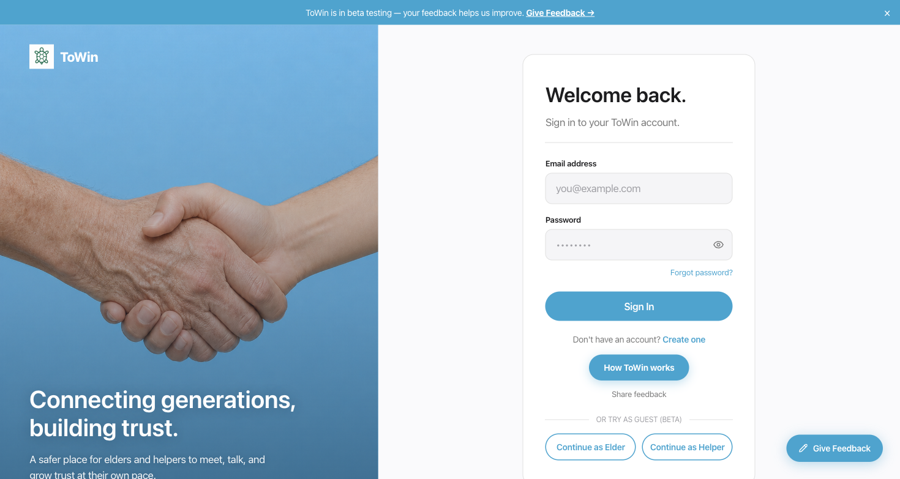

<div align="center">

# 🐢 ToWin

### Connecting generations, building trust.

A social platform where **elders** and **younger helpers** meet, talk, and grow trust at their own pace.

**[🚀 Try the live demo →](https://towin.vercel.app)**

*No signup needed — scroll to the bottom of the login page and click **Continue as Elder** or **Continue as Helper**.*

</div>

---

## 📸 A look inside

| Login | Trust Score |
|:---:|:---:|
|  |  |

| Elder Dashboard | How It Works |
|:---:|:---:|
|  |  |

---

## ✨ What you can do

- 🤝 **Build trust gradually** — connections move through levels (message → phone → meet), and **both people** confirm each step.
- 📝 **Post & answer needs** — elders post tasks, helpers apply, accepting one starts a connection.
- 💬 **Chat in real time** — WebSocket messaging; phone numbers stay hidden until trust is earned.
- ⭐ **Earn a trust score** — verification, completed help, and reviews build a 0–100 score.
- 🔥 **Keep a streak** — daily elder check-ins.
- 🚨 **Stay safe** — emergency contacts, SOS, reviews, and reports.
- 👀 **Try it instantly** — one-click guest mode for beta testers.

---

## 🛠 Built with

**Frontend** — React 19 · Vite · React Router · TanStack Query
**Backend** — Java 21 · Spring Boot 3 · Spring Security (JWT) · JPA · Flyway
**Database** — PostgreSQL
**Optional** — Redis (cache) · Kafka (events) — flag-gated, on locally, off in prod
**Hosting** — Vercel (frontend) · Railway (backend + Postgres)

---

## 🚀 Run it locally

```bash
# 1. Start the database (Redis + Kafka optional)
docker compose up -d postgres

# 2. Backend → http://localhost:8080
cd backend && ./mvnw spring-boot:run

# 3. Frontend → http://localhost:5173
cd frontend && npm install && npm run dev
```

Flyway runs the migrations automatically on boot. Copy `.env.example` to `.env` first and fill in the secrets.

> Want the full Redis + Kafka stack for a demo? Run `docker compose up -d` — both are enabled locally via `APP_REDIS_ENABLED` / `APP_KAFKA_ENABLED`.

---

## 📁 Project structure

```
ToWin/
├── backend/      Spring Boot API (auth, trust, needs, messaging, streaks…)
├── frontend/     React + Vite SPA
├── docs/         Deployment runbook, specs, screenshots
└── docker-compose.yml
```

---

## 🧠 How the trust score works

| Factor | Points |
|---|---|
| Phone verified | +10 |
| ID verified | +20 |
| Each trusted connection *(max +25)* | +5 |
| Each completed help *(max +15)* | +3 |
| Average review rating | 0–10 |
| Active 30+ days | +5 |
| Each report received | −15 |

Scored 0–100, with auto-suspend on abuse.

**Roles:** `ELDER` · `HELPER` · `ADMIN` *(a `BOTH` role is reserved for a future feature)*

---

## 📚 More docs

- **[Deployment runbook](docs/DEPLOYMENT.md)** — hosting, env vars, dump/restore, recovery
- **[Specs & plans](docs/superpowers/)**
- **[Business pitch](docs/ToWin-Business-Pitch.docx)** · **[Technical doc](docs/ToWin-Technical-Documentation.docx)**

<div align="center">
<br>
Built with care for older adults and the people who help them. 🐢
</div>
