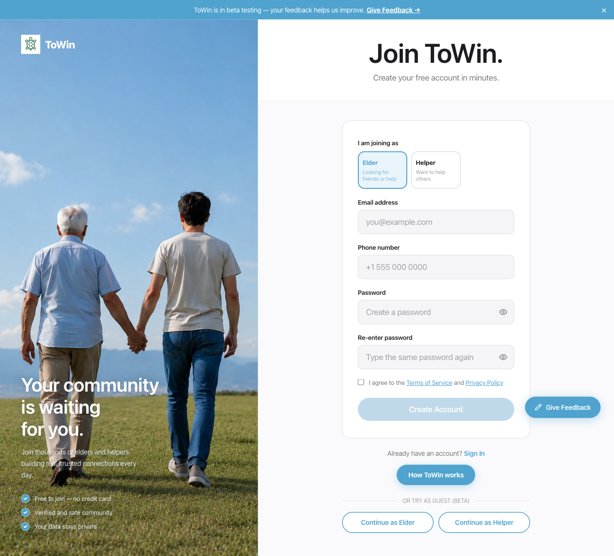

# ToWin

A social platform connecting elderly people with each other and with younger helpers — built around a **trust journey** that gradually unlocks contact and meeting capabilities as users earn each other's confidence.

> ### 🚀 Try the live demo — no signup needed
>
> **[towin.vercel.app](https://towin.vercel.app)** — open the site and scroll to the bottom of the Login page. Hit **Continue as Elder** or **Continue as Helper** to jump straight in as a throwaway beta user. Every feature works the same as a real account.

---

## Features

| | |
|---|---|
| ✅ Progressive trust connections | Two users move through trust levels (message → phone → meet) with mutual confirmation at each step |
| ✅ Need posts & applications | Elders post tasks; helpers apply; accepting a helper auto-creates an active connection |
| ✅ Real-time messaging | WebSocket-backed chat with trust-gated phone reveal |
| ✅ Trust score (0–100) | Phone/ID verification, completed services, reviews, reports — auto-suspend on abuse |
| ✅ Streaks | Daily elder check-in feeds into trust score |
| ✅ Emergency contacts + SOS | Inactivity detection and Twilio SMS escalation |
| ✅ Reviews & reports | Post-interaction safety + accountability surface |
| ✅ Beta guest mode | One-click throwaway accounts for testers (no email/password) |
| ✅ Admin panel | Moderation queue + manual ID verification |
| ✅ Discovery | Helper / elder search with role-based filters |

For the full product story see [`docs/ToWin-Business-Pitch.docx`](docs/ToWin-Business-Pitch.docx) and architecture details in [`docs/ToWin-Technical-Documentation.docx`](docs/ToWin-Technical-Documentation.docx).

---

## Screenshots

| Login | Register |
|---|---|
|  |  |

Both pages end with an **OR TRY AS GUEST (BETA)** divider and the two outline pills so beta testers can sidestep signup entirely.

---

## Tech stack

**Backend** — Java 21, Spring Boot 3.2, Spring Security (JWT), Spring Data JPA, PostgreSQL 18, Flyway. Optional Redis cache and Kafka event bus, both gated behind `app.redis.enabled` / `app.kafka.enabled` flags. AWS S3 for document/photo uploads, Twilio for SMS.

**Frontend** — React 19, Vite, React Router 7, TanStack Query, Radix UI, Framer Motion, plain CSS-in-JS.

**Infra**
- **Local**: Docker Compose runs Postgres + Redis + Kafka so you can demo the full stack.
- **Production**: backend + Postgres on [Railway](https://railway.com), frontend on [Vercel](https://vercel.com). Redis and Kafka are not deployed to prod (flags default off, in-memory cache + in-process event handling).

---

## Repository layout

```
ToWin/
├── backend/                 Spring Boot service
│   └── src/main/java/com/towin/
│       ├── auth/            registration, login, guest, JWT, phone OTP, ID upload
│       ├── profile/         elder & helper profiles
│       ├── connection/      trust-level state machine
│       ├── trust/           trust score breakdown
│       ├── streak/          daily check-in streaks
│       ├── messaging/       chat + WebSocket
│       ├── need/            need posts & applications
│       ├── emergency/       SOS + emergency contacts
│       ├── review/          post-interaction reviews
│       ├── report/          user reports
│       ├── feedback/        beta feedback form
│       ├── admin/           admin endpoints
│       ├── discovery/       helper / need search
│       └── common/          security, S3, TrustScoreService, cache config,
│                            Kafka producer/consumer, shared entities
├── frontend/                React + Vite SPA (deployed to Vercel)
├── docs/
│   ├── superpowers/         specs and plans
│   ├── ToWin-Business-Pitch.docx
│   └── ToWin-Technical-Documentation.docx
├── notes/                   personal study notes
├── docker-compose.yml       local Postgres + Redis + Kafka
└── README.md
```

---

## Running locally

### 1. Prerequisites
- Java 21, Maven
- Node 20+, npm
- Docker (for Postgres, plus optional Redis / Kafka)

### 2. Configure environment
Copy `.env.example` to `.env` and fill in values (DB credentials, JWT secret, S3, Twilio, etc.):
```bash
cp .env.example .env
```

### 3. Start infra
```bash
# Minimal — just Postgres (Redis and Kafka are optional)
docker compose up -d postgres

# Or full stack with Redis cache + Kafka events
docker compose up -d
```

### 4. Backend
```bash
cd backend
./mvnw spring-boot:run
```
Flyway migrations run automatically on boot. The API listens on `http://localhost:8080`.

To enable Redis or Kafka locally, set `APP_REDIS_ENABLED=true` and/or `APP_KAFKA_ENABLED=true` (already set in `docker-compose.yml` for the `app` service).

### 5. Frontend
```bash
cd frontend
npm install
npm run dev
```
Vite serves on `http://localhost:5173`.

---

## Deployment

The live site runs on **Vercel** (frontend) + **Railway** (backend + Postgres). Redis and Kafka are wired into the codebase but not deployed — they're gated behind feature flags so prod runs with an in-memory cache and in-process event handling.

Full runbook with env vars, redeploy commands, dump/restore steps, and recovery playbooks: **[`docs/DEPLOYMENT.md`](docs/DEPLOYMENT.md)**.

Quick reference:

| Piece | Hosted on | How to deploy |
|---|---|---|
| Frontend (Vite SPA) | Vercel, root `frontend/` | Auto-deploys on push to `main` |
| Backend (Spring Boot) | Railway, Dockerfile build | `railway up ./backend --path-as-root --service backend --detach` |
| Postgres | Railway managed plugin | — |

---

## Key concepts

### Trust journey
A `Connection` between two users carries a `currentTrustLevel`. To advance, **both users** must confirm at the current step; on advancement, confirmations reset and the next level's contact channel unlocks (e.g. phone number is exposed in `ConnectionResponse` once `PHONE_CALL` is reached).

### Trust score
Per `TrustScoreService.recalculate(userId)`, scored 0–100:

| Factor | Points |
|---|---|
| Phone verified | +10 |
| ID verified | +20 |
| Each TRUSTED connection (cap +25) | +5 |
| Each completed service as helper (cap +15) | +3 |
| Avg review rating mapped 0–10 | 0–10 |
| Account active > 30 days | +5 |
| Each report received | −15 |

### Roles
- `ELDER` — posts needs, builds connections, can have emergency contacts, runs streaks.
- `HELPER` — applies to needs, builds connections, accumulates completed-service trust.
- `BOTH` — combined elder + helper capabilities.
- `ADMIN` — moderation surface.

---

## Documentation

- **Deployment runbook:** [`docs/DEPLOYMENT.md`](docs/DEPLOYMENT.md)
- **Specs & plans:** [`docs/superpowers/`](docs/superpowers/)
- **Personal study notes:** [`notes/learning.txt`](notes/learning.txt)
- **Business pitch (Word):** [`docs/ToWin-Business-Pitch.docx`](docs/ToWin-Business-Pitch.docx)
- **Technical documentation (Word):** [`docs/ToWin-Technical-Documentation.docx`](docs/ToWin-Technical-Documentation.docx)
