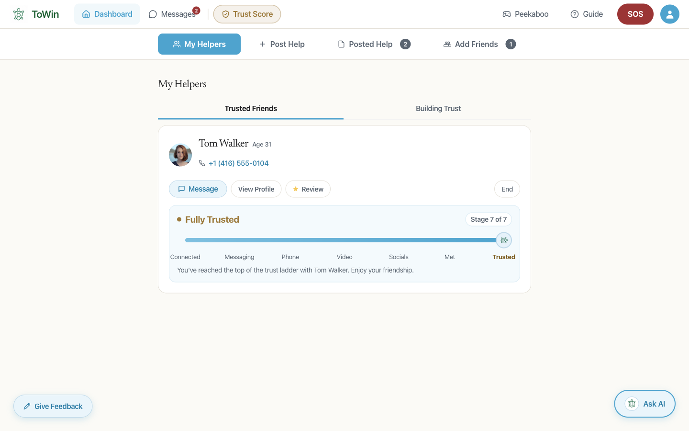
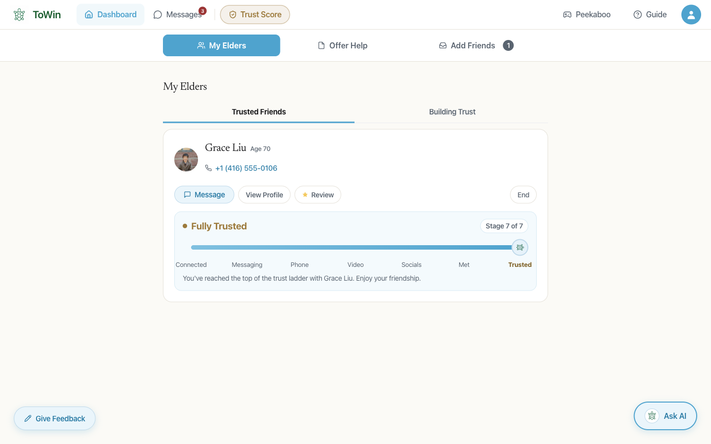
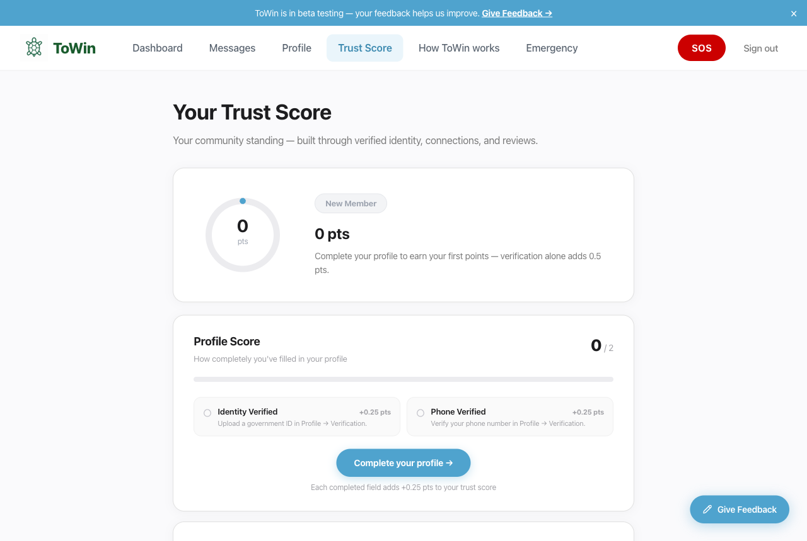
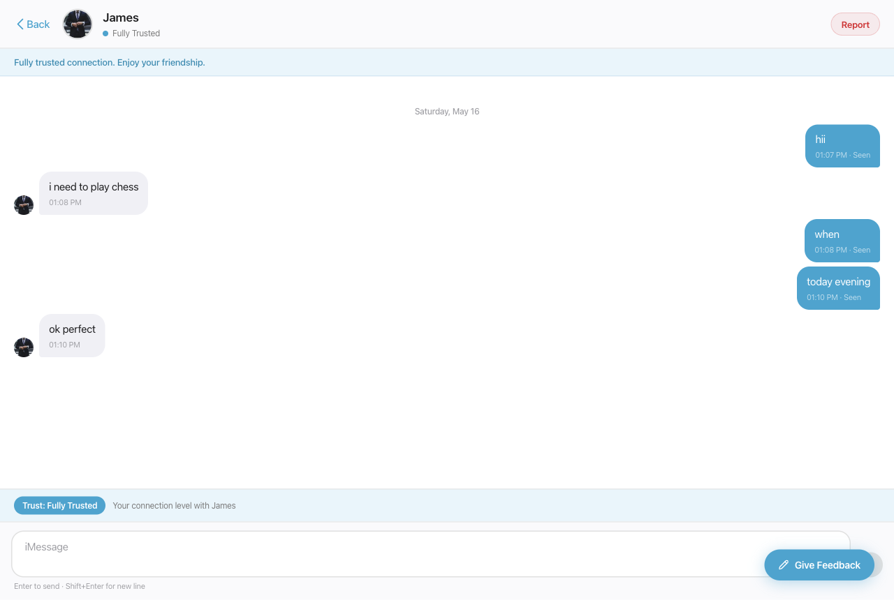
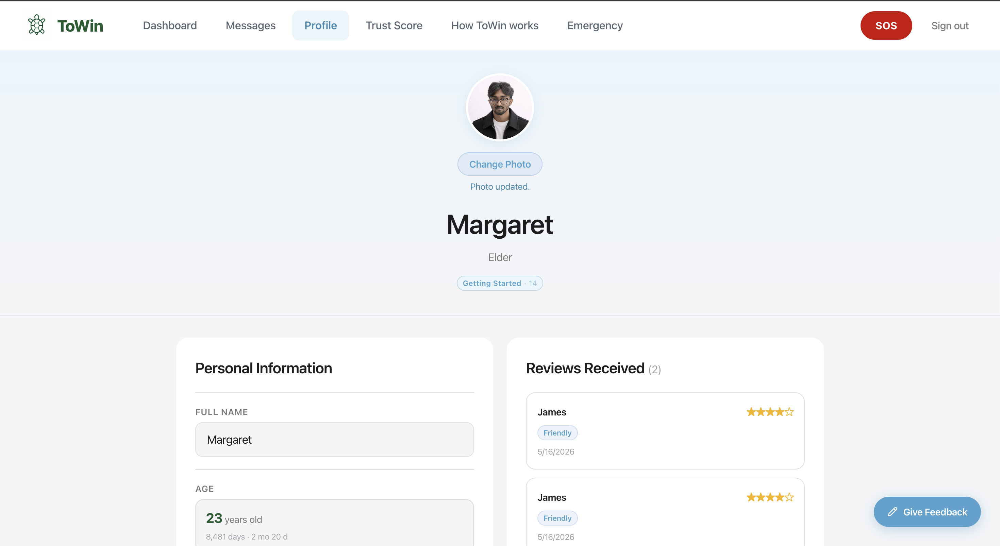
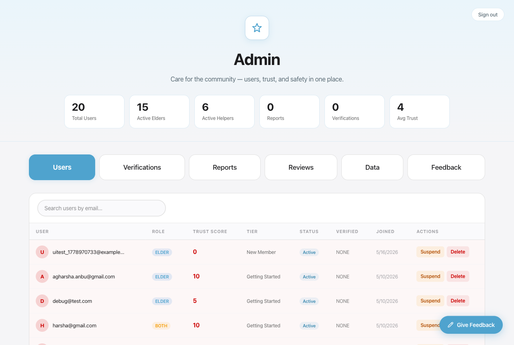
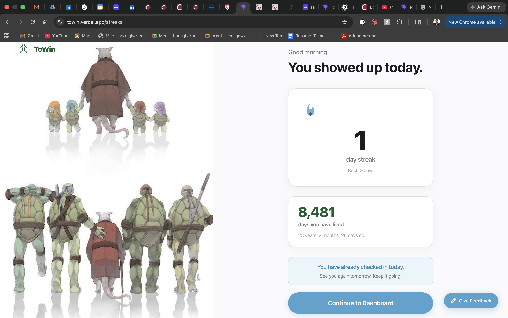
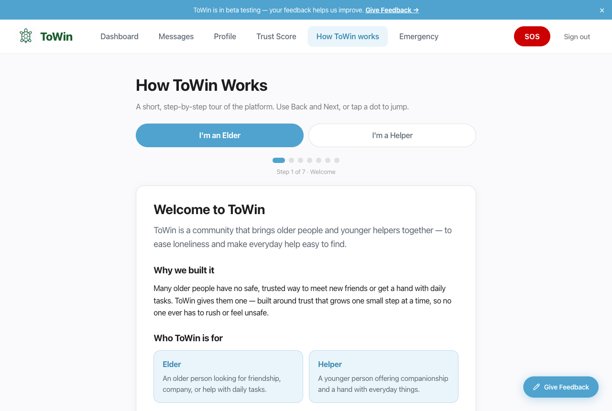

<div align="center">

# 🐢 ToWin

### Connecting generations, building trust.

A social platform where **elders** and **younger helpers** meet, talk, and grow trust at their own pace.

**[🚀 Try the live demo →](https://towin.vercel.app)**

*No signup needed — open the sign-in page and click **Try as an Elder** or **Try as a Helper**.*

</div>

---

## 📸 A look inside

<table>
  <tr>
    <td align="center" width="50%"><b>Elder Dashboard</b></td>
    <td align="center" width="50%"><b>Helper Dashboard</b></td>
  </tr>
  <tr>
    <td></td>
    <td></td>
  </tr>
  <tr>
    <td align="center"><b>Trust Score</b></td>
    <td align="center"><b>Messaging</b></td>
  </tr>
  <tr>
    <td></td>
    <td></td>
  </tr>
  <tr>
    <td align="center"><b>Profile & AWS S3 Photo Upload</b></td>
    <td align="center"><b>Admin Panel</b></td>
  </tr>
  <tr>
    <td></td>
    <td></td>
  </tr>
  <tr>
    <td align="center"><b>Daily Streak</b></td>
    <td align="center"><b>How It Works</b></td>
  </tr>
  <tr>
    <td></td>
    <td></td>
  </tr>
</table>

---

## ✨ What you can do

- 🤝 **Build trust gradually** — connections move through levels (message → phone → meet), and **both people** confirm each step.
- 📝 **Post & answer needs** — elders post tasks, helpers apply, accepting one starts a connection.
- 💬 **Chat in real time** — WebSocket messaging; phone numbers stay hidden until trust is earned.
- ⭐ **Earn a trust score** — verification, completed help, and reviews build a 0–100 score.
- 🔥 **Keep a streak** — daily elder check-ins.
- 🚨 **Stay safe** — emergency contacts, SOS, reviews, and reports.
- 👀 **Try it instantly** — one-click guest mode for beta testers.

---

## 🛠 Tech stack

| Area | Stack | Why I used it |
|---|---|---|
| **Frontend** | React 19 · Vite · React Router 7 · TanStack Query · Axios · Radix UI · Framer Motion | Component-based **single-page application (SPA)** with client-side routing; TanStack Query handles **server-state caching & data fetching**; Radix UI delivers **accessible (a11y / WCAG)**, responsive components |
| **Backend** | Java 21 · Spring Boot 3 · REST API · Spring MVC · Lombok · Bean Validation | Layered **RESTful API** (15 controllers) with **dependency injection** and a clean **controller → service → repository** architecture — the standard enterprise Java stack |
| **Security & Auth** | Spring Security · JWT · BCrypt · RBAC · rate limiting · CORS / CSP | **Stateless JWT authentication & authorization** with **role-based access control (RBAC)**, BCrypt password hashing, brute-force / abuse rate limiting, and **OWASP Top 10**-reviewed hardening |
| **Database & ORM** | PostgreSQL · Spring Data JPA / Hibernate · Flyway · connection pooling | **Relational database (SQL)** accessed through an **ORM** for type-safe, **parameterized (SQL-injection-safe) queries**, with **versioned schema migrations** (Flyway) and pooled connections |
| **Real-time** | WebSocket · STOMP · SockJS | **Real-time**, bidirectional messaging for live chat and notifications |
| **Cloud & Storage** | AWS S3 | **Cloud object storage** for profile photos & ID uploads — server-validated content-type, live in production (bucket `towin-uploads`) |
| **Async & Caching** | Apache Kafka · Redis | **Event-driven** async processing (**pub/sub**) and **caching** — feature-flagged: on locally, off in prod to save cost |
| **Integrations** | Twilio | **Third-party API integration** — SMS for emergency SOS alerts & phone-OTP verification |
| **DevOps & CI/CD** | Docker · Docker Compose · Maven · Vercel · Railway · GitHub | **Containerized** local stack and **CI/CD** auto-deploy to the cloud (Vercel frontend · Railway backend + Postgres) on every push to `main` |
| **Testing & Quality** | JUnit 5 · Mockito · SonarQube · Snyk | **Unit testing** (54 passing tests across 9 service suites), plus **SAST / SCA** security scanning and static **code-quality analysis** |

> **Architecture note for reviewers:** AWS S3, Twilio, Redis, and Kafka are all fully integrated in code. Redis and Kafka are gated behind `app.redis.enabled` / `app.kafka.enabled` so the app runs the complete stack locally (via Docker Compose) but uses an in-memory cache and in-process events in production — keeping the live demo free to host without removing the integrations.

---

## 🚀 Run it locally

```bash
# 1. Start the database (Redis + Kafka optional)
docker compose up -d postgres

# 2. Backend → http://localhost:8080
cd backend && ./mvnw spring-boot:run

# 3. Frontend → http://localhost:5173
cd frontend && npm install && npm run dev
```

Flyway runs the migrations automatically on boot. Copy `.env.example` to `.env` first and fill in the secrets.

> Want the full Redis + Kafka stack for a demo? Run `docker compose up -d` — both are enabled locally via `APP_REDIS_ENABLED` / `APP_KAFKA_ENABLED`.

---

## 📁 Project structure

```
ToWin/
├── backend/      Spring Boot API (auth, trust, needs, messaging, streaks…)
├── frontend/     React + Vite SPA
├── docs/         Deployment runbook, specs, screenshots
└── docker-compose.yml
```

---

## 🧠 How the trust score works

| Factor | Points |
|---|---|
| Phone verified | +10 |
| ID verified | +20 |
| Each trusted connection *(max +25)* | +5 |
| Each completed help *(max +15)* | +3 |
| Average review rating | 0–10 |
| Active 30+ days | +5 |
| Each report received | −15 |

Scored 0–100, with auto-suspend on abuse.

**Roles:** `ELDER` · `HELPER` · `ADMIN` *(a `BOTH` role is reserved for a future feature)*

---

## 🔒 Security

ToWin was reviewed against the **OWASP Top 10 (2021)** and scanned with **SonarQube** (SAST), **Snyk** (SCA + SAST), and **npm audit**. Highlights:

- **Access control** — identity is always derived from the verified JWT (never the request body); resource ownership is re-checked in the service layer (IDOR defense), and a per-request `isActive` check revokes suspended accounts instantly.
- **Auth & abuse limits** — BCrypt password hashing, brute-force lockouts on login and OTP, IP rate limits on registration, and a per-user limiter on paid SMS sends to stop cost abuse.
- **Injection & XSS** — 100% parameterized JPA queries, React auto-escaping, and a strict Content-Security-Policy; no `dangerouslySetInnerHTML` or `eval` anywhere.
- **Hardening** — stateless sessions, an env-driven CORS allowlist (no `*`, applied to HTTP **and** WebSocket origins), security headers (`X-Frame-Options`, `nosniff`, `Referrer-Policy`, CSP), generic error responses that never leak internals, and server-validated uploads with a server-set content-type.
- **Dependencies (OWASP A06)** — Snyk surfaced **90 transitive backend CVEs** and several frontend CVEs that SonarQube and `npm audit` had missed; remediated by upgrading Spring Boot, the AWS SDK, and Twilio to backward-compatible lines → **0 vulnerable paths**, all 54 backend tests still passing.

---

## 📚 More docs

- **[Deployment runbook](docs/DEPLOYMENT.md)** — hosting, env vars, dump/restore, recovery
- **[Specs & plans](docs/superpowers/)**
- **[Business pitch](docs/ToWin-Business-Pitch.docx)** · **[Technical doc](docs/ToWin-Technical-Documentation.docx)**

<div align="center">
<br>
Built with care for older adults and the people who help them. 🐢
</div>
