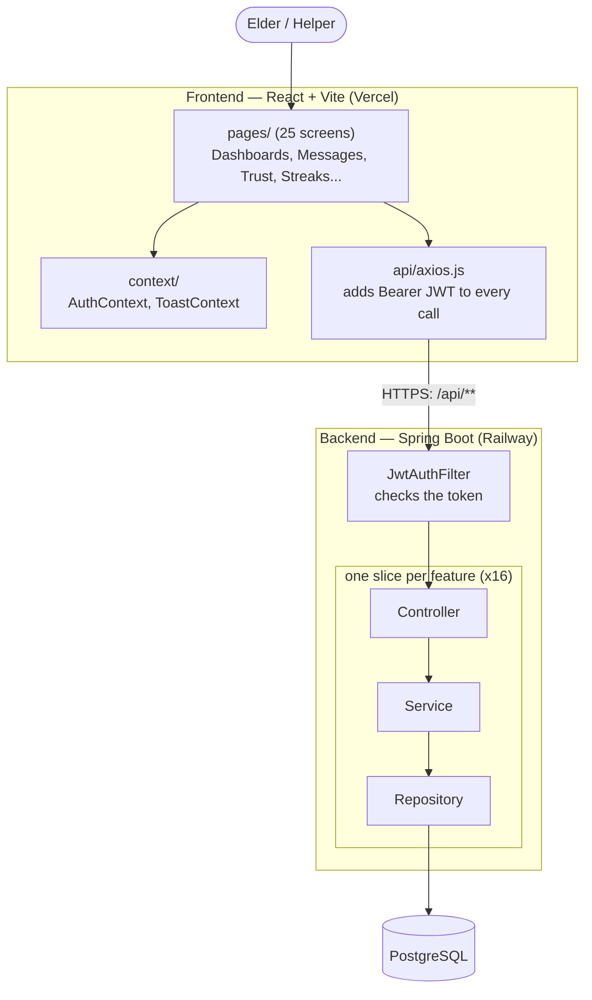

# 1. Flowchart — how a request flows through ToWin

**Syntax you learn here:** `flowchart TB` (top-bottom) or `LR` (left-right),
nodes `A[box]`, `B([rounded])`, `C[(database)]`, arrows `-->`, labels `-- text -->`,
and `subgraph` for grouping.

**Read it as:** every screen talks to one file (`axios.js`), which talks to one
gatekeeper (`JwtAuthFilter`), which hands off to the right feature slice
(auth, need, connection, messaging, trust, streak, review, report, emergency,
feedback, discovery, profile, admin, account, geocoding, oauth).

**Try changing:** `flowchart TB` → `flowchart LR` and re-render. Add a node for
Redis or S3 and draw an arrow from the backend.
