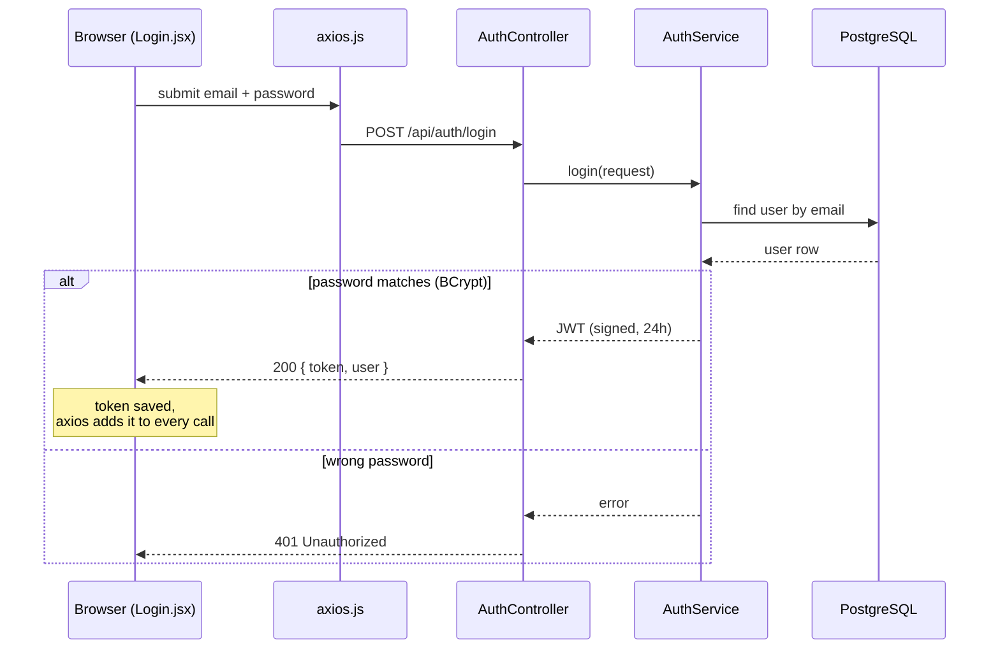
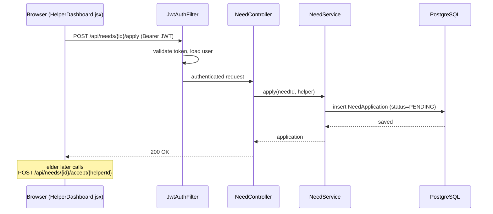

# 2. Sequence — who calls whom, in what order

**Syntax you learn here:** `sequenceDiagram`, `participant X as Label`,
solid arrow `->>` (call), dashed arrow `-->>` (response), `Note over`, and
`alt / else / end` for branching.

## Login (real flow from AuthController)

## An authorized call (apply to a need)

**Try changing:** add a `participant R as Redis` and show a cache check before
the database. Or draw the SOS flow: `POST /api/emergency/sos` → Twilio.
