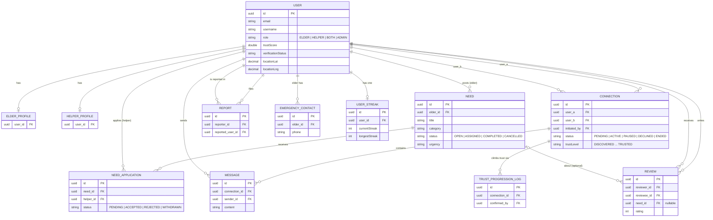

# 3. Entity Relationship — the ToWin database

**Syntax you learn here:** `erDiagram`, entities as blocks with typed fields,
and relationship lines: `||` exactly one, `o|` zero or one, `o{` zero or many.
So `USER ||--o{ NEED : posts` reads "one user posts zero-or-many needs".

Drawn from the real JPA entities (`@JoinColumn` names shown as fields).

Standalone tables not shown: `FEEDBACK` (anonymous allowed) and
`PENDING_REGISTRATION` (email-verification holding area).

**Try changing:** add the `FEEDBACK` entity yourself, or flip a `o{` to `|{`
(one-or-many) and see how the crow's foot changes.
