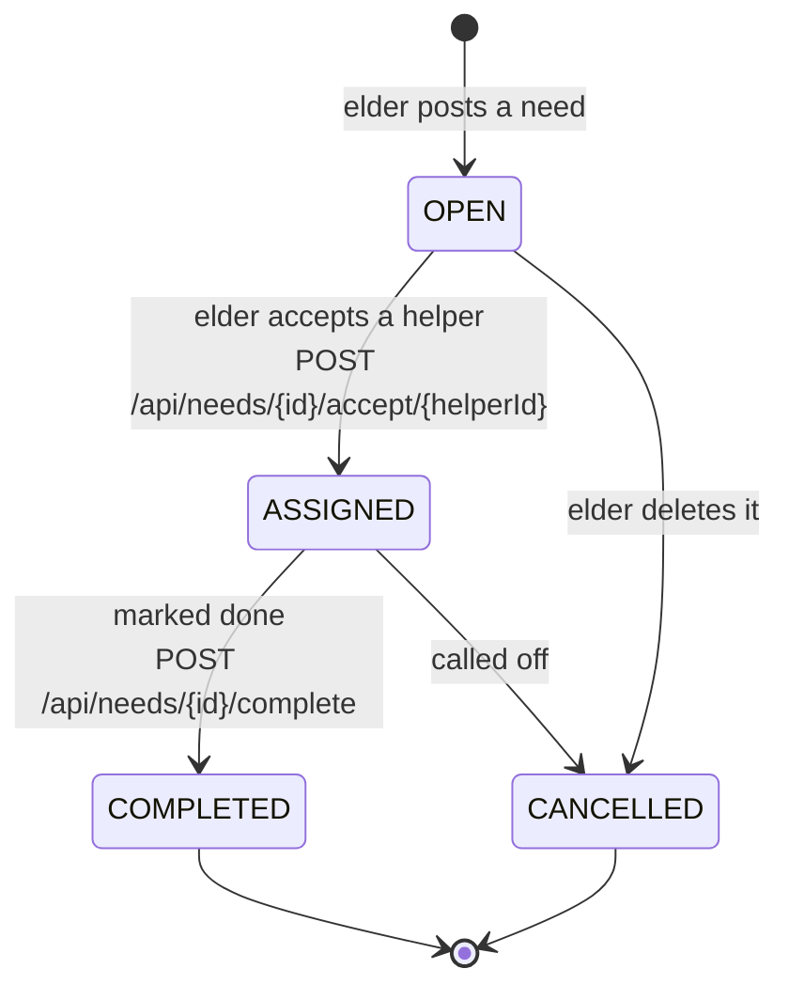
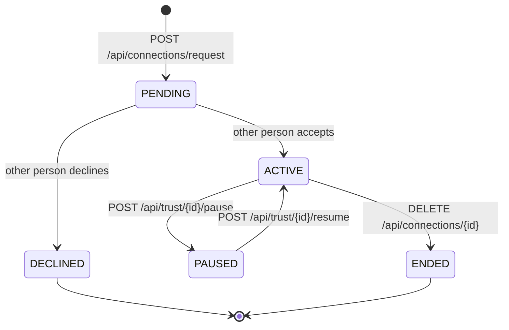
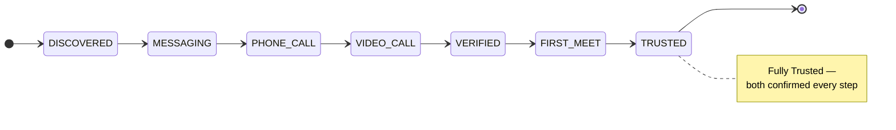

# 4. State — the lifecycles inside ToWin

**Syntax you learn here:** `stateDiagram-v2`, `[*]` for start/end,
`A --> B : what causes it`, and `note right of`.

All three are real enums from `com.towin.common.enums`.

## Need lifecycle (`NeedStatus`)

## Connection lifecycle (`ConnectionStatus`)

## Trust ladder (`TrustLevel`) — one direction only, both people confirm each step

**Try changing:** `ApplicationStatus` is the one lifecycle not drawn here
(PENDING → ACCEPTED / REJECTED / WITHDRAWN). Draw it yourself — it's 5 lines.
