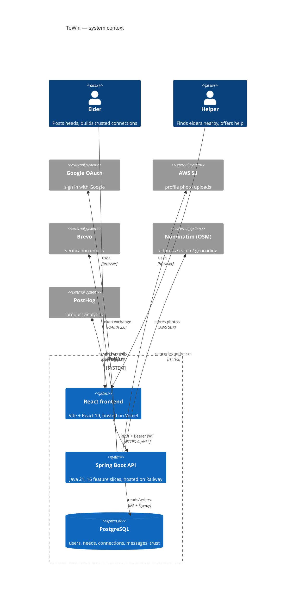

# 5. C4 context — the big picture (people, systems, services)

**Syntax you learn here:** `C4Context`, `Person()`, `System()`, `SystemDb()`,
`System_Ext()` for third-party services, `System_Boundary` to group what you own,
and `Rel(from, to, "what", "how")`.

This is the real deploy: frontend on Vercel, backend on Railway.

**Read it as:** two kinds of people use one frontend; the frontend only ever
talks to your API; the API owns the database and delegates specialties
(login, photos, email, maps, analytics) to outside services.

**Try changing:** add `System_Ext(twilio, "Twilio", "SOS SMS")` and a
`Rel(be, twilio, "sends SOS", "SMS")` — that service exists in the code too.
