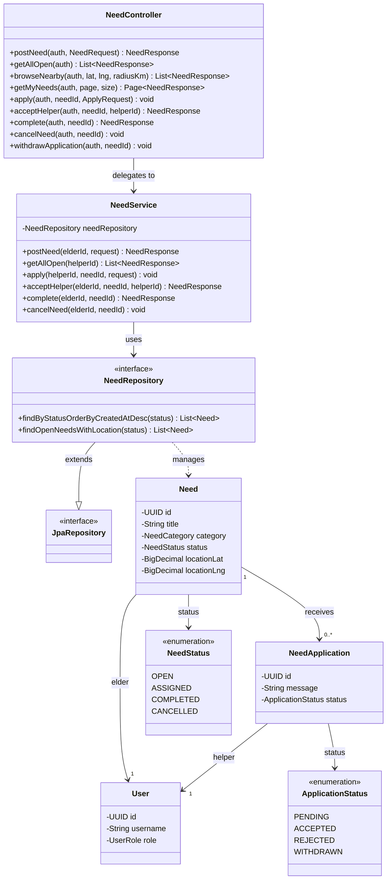

# 6. Class — the Need feature slice, as classes

**Syntax you learn here:** `classDiagram`, members with `+` (public) / `-` (private),
`<<interface>>` and `<<enumeration>>` tags, generics with `~T~` (i.e. `List~Need~`),
and the arrows: `--|>` extends, `-->` has/uses, `..>` depends on.

All names are real — from `com.towin.need`.

**Read it as:** the classic Spring layering — controller holds no logic and
delegates to the service; the service owns the rules and talks to the repository;
the repository is just an interface that Spring Data implements for you
(that's the `--|> JpaRepository` inheritance).

**Try changing:** draw the messaging slice the same way
(`MessageController → MessageService → MessageRepository → Message`). Every
slice in the backend follows this exact shape, so one template fits all 16.
